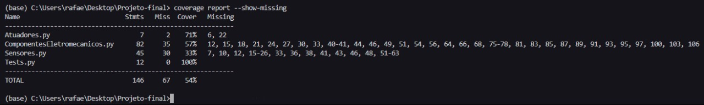
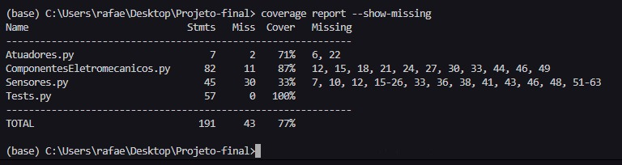
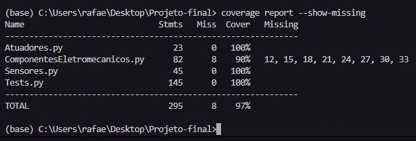

# Hierarquia de classes funcionais dos principais componentes eletrônicos.

1 . Classe raíz: Componentes eletromecanico
2 . Classes derivadas': Sensores e Atuadores 
3 . Classes derivadas": Temperatura, Pressão e Pneumatico, Hidraulico

# Atributos de cada classe:

    Classe Componentes_Eletromecanicos:
        1- Grandeza (unidades)
        2- Função (monitorar e agir)
        3- Estado (on/off)

        -> implementa um metodo abstrado (get/set)Grandeza()
        -> implementa um metodo abstrado (get/set)Função()
        -> implementa um metodo abstrado (get/set)Estado()

        -> métodos ligar(), desligar()

        Classe Sensores:
            1- valorLido
            2- valorMaximo

            -> implementar (get/set)ValorLido()
            -> implementar (get/set)valorMaximo()
            
            -> set/getFuncao: "medir"

            -> metodo ligar() e desligar(): "Sensor ligado"/"Sensor desligado"
            -> metodo medir(getValorLido)
            -> metodo maximo(getValorMaximo)

            Classe Temperatura:

                (????)-> Implementar um metodo "PadronizarValorLidoTemp(getValorLido)" usando atributo "Grandeza"
                
                -> set/getGrandeza: (ºC,K,ºF)
                -> set/getFuncao: "medir temperatura"

                -> metodo ligar e desligar(): "Sensor de temperatura ligado"/"Sensor de temperatura desligado"
                -> metodo medir(getValorLido + getGrandeza)
                -> metodo maximo(getValorMaximo + getValorMaximo)

            Classe Pressão:

              (????)-> Implementar um metodo "PadronizarValorLidoPressao(getValorLido)" usando atributo "Grandeza"
                
                -> set/getGrandeza: (atm,mmHg,Pa)
                -> set/getFuncao: "medir pressão"

                -> metodo ligar() e desligar(): "Sensor de pressão ligado"/"Sensor de pressão desligado"
                -> metodo medir(getValorLido + getGrandeza)
                -> metodo maximo(getValorMaximo + getGrandeza)
            
        Classe Atuadores:
            1- posicao
            2- atuador
    
            -> implementar (get/set)posicao(): "inicio do atuador"/"fim do atuado"
            -> implementar (get/set)atuador(): "fluido"
            
            -> set/getFuncao: "agir"

            -> metodo ligar() e desligar(): "Atuador ligado"/"Atuador desligado"
            -> metodo avancar() e recuar(): "Fim do atuador"/"Início do atuador"

            Classe Pneumatico:

                -> set/getGrandeza: (atm,mmHg,Pa)
                -> set/getFuncao: "agir sob pressão do ar"
                
                -> metodo ligar() e desligar(): "Pistão pneumático ligado"/"Pistão pneumático desligado"
                -> metodo avancar() e recuar(): "fim do pistão pneumático"/"inicio do pistão pneumático"

            Classe Hidraulico:
                -> set/getGrandeza: (atm,mmHg,Pa)
                -> set/getFuncao: "agir sob pressão de óleo hidráulico"
                
                -> metodo ligar() e desligar(): "Prensa hidráulica ligada"/"Prensa hidráulica desligada"
                -> metodo avancar() e recuar(): "fim da prensa hidráulica"/"inicio da prensa hidráulica"

# metodos para as classes

Metodos para atuador:

    1. getPosicao e setPosicao
    2. getFluido e setFluido

Metodos para sensores:

    1. getValorLido e setValorLido
    2. getFaixa_operacional e setFaixa_operacional

Metodos para Componentes

# Polimorfismo

Consiste em uma classe possuir métodos que se moldam adequadamente independente do tipo de entrada, realizando operações com atributos das classes.

# Casos de teste iniciais

Testes para validador da classe Temperatura:
    1 - Valor lido deve ser um numero (float)
    2 - Deve possuir duas casas decimais
    3 - Deve possuir grandezas válidas para temperatura

Testes para validador da classe Pressao:
    1 - Valor lido deve ser um numero (float)
    2 - Deve possuir duas casas decimais
    3 - Deve possuir grandezas válidas para pressao

# Introdução

Esta hierarquia está voltada para o contexto da área de engenharia elétrica, onde são descritos 3 níveis de hieraquia de Classes
começando com 'Componentes_Eletromecanicos' que seria a classe abstrata. em seguida classificamos o segundo nível da hierarquia como
as Classes de 'Sensores' e 'Atuadores', e em seguida o ultimo nível com mais duas classes derivadas de cada uma das classes anteriores que
exemplificam alguns exemplos de sensores e atuadores existentes na eletrônica, que são as classes 'Temperatura', 'Pressao', 'Pneumatico' e 'Hidraulico'.

# Hierarquia
Apresentar cada classe mostrando seus métodos e atributos

# Herança
Inserir print do codigo que exemplifique conceito de herança

# Polimorfismo
Inserir print do codigo que exemplifique conceito de polimorfismo

# Encapsulamento
Inserir print do codigo que exemplifique conceito de encapsulamento

# Relatório de cobertura de código

    - Resultado de 54% coberto

Implementação feita até metade da segunda hierarquia
    
    - Resultado de 77% coberto

Implementação feita até o segundo nível de hierarquia 

    - Resultado de 97% coberto

Implementação completa

# Conclusoes

Foi desenvolvido um modelo de hierarquia para um segmento de componentes eletrônicos muito comuns em projetos do curso de engenharia eletrica, utilizando a programação
orientada a objeto priorizando a pratica dos conceitos de polimorfismo, encapsulamento e herança em python, com desevolvimento orientado a teste. O maior desafio foi definir 
a estrutura da hieraquia pensando nos metodos que seriam implementados para obter os atributos e os casos de teste.